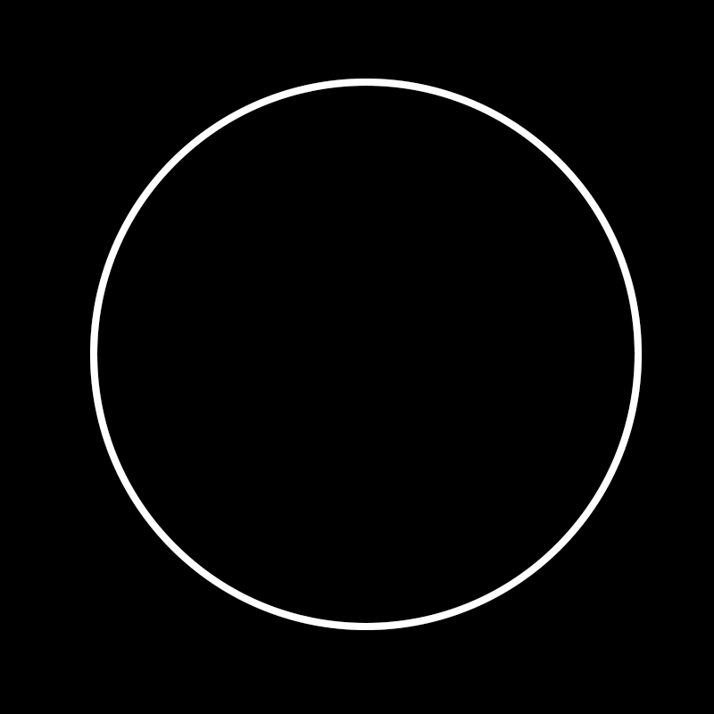

# 画钟测试

一个用 Python 3 (3.7.0) 实现的[画钟测试（Clock Drawing Test）](https://en.wikipedia.org/wiki/Executive_dysfunction#Clock_drawing_test)评分系统。


### 目录

- [背景介绍](#bg)
- [依赖](#dependencies)
- [维护与开发](#dev)
    - [虚拟环境](#1)
    - [交互方式](#2)
    - [输入图像](#3)
        - [输入图像预处理](#3-1)
    - [计分思路](#4)
        - [第一分](#4-1)
        - [第二分](#4-2)
    - [包与模块](#5)
        - [包与模块目录](#5-1)
    - [数据模型](#6)
    - [函数式编程思想](#7)
        - [Python函数式编程介绍](#7-1)
        - [装饰器与闭包](#7-2)
        - [函数式编程与面向对象编程的矛盾](#7-3)
    - [惰性求值](#8)

    - [测试](#test)
    - [未来扩展](#mirai)
        - [输入图像预处理](#mirai-preprocessing)
        - [计分思路](#mirai-scoring)


## <span id='bg'>背景介绍</span>

画钟测试是一项简单易行，准确性高而且文化相关性小，全面地反映认知功能的失智症筛查测试，可作为检查老年性痴呆的早期筛查工具。

徒手画钟表是一个复杂的行为活动，除了空间构造技巧外，尚需很多知识功能参与，涉及记忆、注意、抽象思维、设计、布局安排、运用、数字、计算、时间和空间定向概念、运作的顺序等多种认知功能。

画钟测试有多种计分表，本系统采用4分制，分别为：

- 封闭的圆
- 位于圆内并且均匀分布的刻度
- 位于园内均匀分布，并且按 1 - 12 顺序排列的数字
- 指向正确时间（由测试方指定）的时针与分针


## <span id='dependencies'>依赖</span>

- [OpenCV](https://opencv.org/):

`pip install opencv-python`

- [Numpy](https://numpy.org/):

`pip install numpy`

确保在你的 Python 3 shell 中可以运行以下语句：

```python
import numpy
import cv2
```


## <span id='dev'>维护与开发</span>

### <span id='1'>虚拟环境</span>

你可能会想在开发中使用虚拟环境安装这些依赖。我个人推荐使用 [pyenv](https://github.com/pyenv/pyenv) 和 [pyenv-virtualenv](https://github.com/pyenv/pyenv-virtualenv).


### <span id='2'>交互方式</span>

本系统希望使用半交互方式进行画钟测试，换而言之就是由系统给出文本提示，然后交由受测者完成并提交进行下一步。

流程示例：

**请画出一个封闭的圆作为钟表盘** → *用户画出圆并提交下一步* → **请在画出钟表的时间刻度** → *用户画出刻度并提交下一步* → **请画出钟表的时间刻度对应数字** → *用户画出数字刻度并提交下一步* → **请在钟表上画出指向「指定时间」的时针和分针** → *用户画出时针和分针并提交下一步* → *显示最终评分*

（粗体字代表系统显示的文本提示，斜体字代表用户或系统的行为）


### <span id='3'>输入图像</span>

每一次获得新的图像，与上一步的图像进行差集操作，以获得每一步的图像，再将每一步的图像作为输出进行评分。

图示：




#### <span id='3-1'>输入图像预处理</span>

本系统的交互方式可以在不同的平台上实现，只要提供给系统一个生产队列即可。举例说明，可以使用Web网页显示文本提示和下一步按钮，并且提供一个Canvas画板供受测者作画。这样做的好处是，图像不需要过多的预处理，而且本身就可以是二值图。但是从另一个角度说，这种做法会给受测者带来一定的操作门槛和麻烦，并且鼠标作画相比纸笔作画（特别是对于高龄受测人群），准确度不可避免的会有所下降。

另一种可行的方法（特别是在有协助者在场，如医院等应用场景）就是使用拍照上传作为与系统的交互手段。在这种方式下，系统不与受测者直接沟通。作为代替，由协助者代替系统传达作画提示，并且将受测者的作画上传至系统进行评分。这种做法和上面所提到的做法相反，给受测者带来了诸多便利，并且尽量与人工测试提供的环境和体验保持一致，但是相反就需要对拍照的图像进行一定的预处理。

图像的预处理是一个庞大的问题，背后牵扯诸多细节。鉴于本系统不过多涉及交互部分与细节，这里仅提供部分基础的图像预处理方案方便用户按需取用，更多扩展方案详见[未来扩展 – 输入图像预处理](#mirai-preprocessing)。

本系统提供的预处理方案：

- 二值化
- 开闭操作
- 舍弃内部面积过小的轮廓图形（防止笔误）

### <span id='4'>计分思路</span>

*\* 目前本系统只实现了前两分的评分，详见[未来扩展 - 计分思路](#mirai-scoring)。*

#### <span id='4-1'>第一分 - 封闭的圆</span>

利用圆是同等周长下面积最大的图形这一特质进行圆度计算。可以使用轮廓长度（即周长）比轮廓面积（即面积）计算，也可以使用最大内切圆与轮廓面积的比计算。如果圆度超过阈值，则认为通过。

轮廓长度与轮廓面积均可通过OpenCV内置的轮廓函数计算得出。而内切圆则需要复杂一点的计算。求内切圆时，遍历图形轮廓内的所有点，并且计算每个点到轮廓的最短距离。距离最大的点则为内切圆圆心，距离则为内切圆半径。

具体应用时，先用轮廓创建一个蒙版（Mask），然后在蒙版上应用[距离变换（Distance Transform）](https://en.wikipedia.org/wiki/Distance_transform)（Distance Transform），求出轮廓内的距离场，得到一个包含所有距离的列表，然后选取最大值。

图示：


#### <span id='4-2'>第二分 - 位于圆内并且均匀分布的刻度</span>

将表盘最大内切圆12等分，取每一份扇形的中间部分作为刻度的区域。如果一共仅有12个刻度元素，并且12个区域内均有且仅有一个刻度，则认为通过。

评分时，系统认定只要一个刻度元素重心位于扇形的中心区域内，并且至少两个最小外接矩形的顶点位于扇形内，即可判断为位于扇形的中心区域内。同时按顺序遍历12个扇形和按照时钟顺序排序的刻度元素，依次判断是否一一对应。

评估一个指定点是否在给定区域时，可以使用OpenCV提供的`pointPolygonTest`函数，用于判断一个指定点和一个给定轮廓的空间关系。


### <span id='5'>包与模块</span>

#### <span id='5-1'>包与模块目录</span>

以下为本项目的完整目录（排除README及相关图片等文件）：

```
- apps
    -circularity
        circularity.py
        tests.py
    -scale
        scale.py
        tests.py
    app.py
    tests.py
- excepts
    lazy_excepts.py
    mixin_excepts.py
- imgs
    ...
- models
    - model_mixins
        image_mixin.py
        scale_element_mixin.py
        scale_image_mixin.py
        tests.py
    - scale
        scale_element.py
        scale_image.py
    circle.py
    clock_face.py
    element.py
    element_image.py
    tests.py
- utils
    - metas
        meta_mixin.py
        meta_singleton.py
        meta_singleton.mixin.py
        tests.py
    create_imgs.py
    lazy_property.py
    mixin_template.py
    subscribe_methods.py
    tests.py
CDT.py
experiment.py
image_generator.py
image_loader.py
settings.py
tests.py
```

简化为目录（加粗的为核心功能包）：

**`- apps`**
**`    - circularity`**
**`    - scale`**
**`- models`**
**`    - scale`**
```
    clock_face.py
- experiment.py
- CDT.py
```

显而易见，`apps`包中包含了`circularity`和`scale`这两个提供模块化测试的包，而`models`包中包含了提供`scale app`所需的数据模型的`scale`包和提供钟表表盘数据模型的`clock_face.py`。

#### <span id='5-2'>架构模式</span>

从上面的目录不难看出，本项目采取的是[MVC架构模式](https://zh.wikipedia.org/wiki/MVC)。其中，`View`部分预期由客户程序完成（如上文提到的Web网页画板），而在本项目中则由`CDT.py`提供简易的命令行交互界面。`Model`部分代表程序操作的数据模型，譬如`ClockFace`, `ElementImage`, `Element`, `Circle`等。针对这些数据模型进行操作的便是评分系统。在本项目中，评分系统根据每一分的得分要求细分模块化为多个`App`，最后由`Experiment`对象进行统一的调用和整体评估，得出最终的分数。这里便是身为桥梁，沟通`Model`和`View`的`Controller`部分。

在良好的职责分离，高内聚低耦合的MVC模式下，本项目得以为各个部分独立进行单元[测试](#test)。项目整体的可测试性，可扩展性，可维护性皆有所保障。


### <span id='6'>数据模型</span>

如上文所提，本项目是基于MVC模式开发，完成了`Model`和`Controller`两部分，`View`可部分交由客户程序完成。所以本项目的重点在于对数据模型的操作评估上。这里介绍一下本项目所使用的数据模型。

本项目获得的输入是客户点击n次下一步后得到的n张输入图像（n为`App`的数量），是同上一张输入图像（如果存在）进行差值操作得到的，针对单独每一步的输入图像，其中只会包含每一个`App`所需的元素。针对这一特性，我们首先创建一个`Element`父类表示所有的元素。与此同时，每次得到的输入图像中常常包含不止一个元素（如12个刻度，12个数字，2个指针），所以实际使用时一般是对一个`Element`序列进行操作，而不是对单个`Element`进行操作。因此，我们又需要一个对`Element`序列进行包装的对象`ElementImage`。

除此之外，有一个特殊情况便是身为第一个`App`的`Circularity`，表盘圆度评估。表盘圆度评估并不存在单个的元素或者元素序列，仅仅是对单一的圆形进行评估。当然你可能会产生疑问，难道单一圆形不能够作为元素，然后让整个`ElementImage`仅作为一个元素的序列包装吗。这里要考虑到一个问题，就是后续的其他`App`的评估离不开表盘和表盘近似圆（比如刻度评估需要12等分表盘进行），这就意味着`ClockFace`对象不能够像其他的钟表元素一样独立存在。

因此，我们将`ClockFace`作为特例，不计入`ElementImage`中作为子类，而是作为一个单独的对象。同时，由于需要提供针对表盘的一系列接口方便对其他`ElementImage`对象进行评估，但是开放`ClockFace`这个特殊的“元素图”给同级的其他`ElementImage`对象并不是一个好的做法，所以我们需要一个代理对象，让`ClockFace`和其他同级的`ElementImage`对象都可以访问，来提供表盘的圆形信息，也就是`Circle`对象的由来。

`Circle`对象作为一个抽象的圆形，我们剥离了其身为表盘的属性，作为一个单纯的几何图形看待，这样就避免了破坏同级模块之间的封装，依然维持了仅由各自上级模块进行操作的初衷。对于各个`ElementImage`对象来说，`ClockFace`对象依然是同级的被封装的黑盒子，他们仅能够访问上级模块提供的`Circle`对象（虽然这个`Circle`对象由`ClockFace`对象提供，但是并不由`ClockFace`对象直接交予同级的`ElementImage`对象，而是通过上级模块作为沟通的桥梁，维持了信息的隐藏封装），然后依此评估各自的`Element`对象。但是实际上，这个问题并没有被如此简单的就完美解决，详见[惰性求值 - 带来的问题]()

`Element`对象自身保留一系列自评估方法，用于完成所有不需要除了`Circle`对象以外的所有外界信息（比如其他`Element`对象的位置）的评估。这种类型的自评估包括刻度元素的位置评估。同时，有时候需要把`Element`元素序列进行近一步的排序和归类，比如按照空间关系进行顺时针排序，还有如将10,11,12这三个时间数字的六个元素（因为OpenCV会认为一个数字是一个图形，并不能够将它们按照数字逻辑归类）打包到一起成为三个时间再交由上级模块评估，就要由对`Element`序列进行包装的`ElementImage`来完成。最后，在评估元素的时候，有时候需要其他元素的参与，譬如数字12的1和2要作为整体进行评估，这些需要按需联系多个元素进行同时评估的任务，不能交由元素自评估（1和2都分别不清楚对方的存在），就交由上层的`App`对象通过访问`ElementImage`来完成。这就是本项目的任务分级制度。

对于评估元素，这里需要澄清一下`Circle`以防误解。如上文所提，我们希望`Circle`仅仅作为一个圆的对象，剥离其对于钟表的意义。但是事实上，`Circularity - ClockFace - Circle`这样的模型是符合`App - ElementImage - Element`的模式的。这个特例特殊的地方就在于，本来应该由身为`Element`位置的`Circle`对象来进行自评估圆度的行为，由于我们希望剥离`Circle`身为几何图形以外的含义（也就是说我们实际上不认为`Circle`是一种`Element`），被转移到了身为`App`模块的`Circularity`中了。这样子是一个对于特殊情况的妥协。既没有破坏现有封装，也在稍微牺牲语义的基础上维持了现有的模型结构。

当然，对于这个问题还有一种颇为可行的解决方案就是，制作一个`ClockFaceElement`类作为`Element`，然后使用`Circle`类作为一个代理包装一下`ClockFaceElement`类，隐藏其身为钟表元素的所有行为和属性，然后封装成一个纯几何图形`Circle`向外提供一系列接口。这样使用代理类`Circle`，既保持了封装（其他`Element`对象依然只能得到一个纯几何图形`Circle`），又完美保持了模型的`App - ElementImage - Element`结构和语义。不过我的个人理解是，鉴于我们在使用Python而不是Java，添加代理类解决这种结构上的小瑕疵不符合我们的Python以简洁为本的编程思想，于是就选择了上面的方案。


### <span id='7'>函数式编程思想</span>

本项目中虽然是以面向对象编程和一些Java的编程思想为基本，也不乏大量的[函数式编程（Functional Programming）](https://en.wikipedia.org/wiki/Functional_programming)思想运用。其中以Python提供的一系列函数式编程函数为首，包括了`map`，`reduce`，`filter`，`partial`，`zip`等，配合Python自身对于函数对象的处理和编程思想，完成了大量功能。函数式编程的代表语言[Lisp](https://en.wikipedia.org/wiki/Lisp_(programming_language))，名称源自"LISt Processor"。无论对于Lisp还是Python，列表都是一个重要的数据结构。在动态类型语言下，配合Python“一切都是对象”的设计哲学，列表变得无比强大。除了传统意义上的保存一系列数据以外，Python的列表也可以保存一系列行为（函数对象）。这里我们先简单介绍上面5个Python提供的函数式编程函数，后面的内容也会或多或少涉及，不过这里不过多阐述。

#### <span id='7-1'>Python函数式编程介绍</span>

一般对于数据的处理，我们可以抽象为一个`map`后接`reduce`的一个过程。`map`代表的是对数据的一系列预处理，预处理行为被`map`到每一个列表的元素上。`reduce`代表的是数据的归纳，将一整个列表的元素归纳处理成为结果。在函数式编程时，我们会需要大量用到`lambda`匿名函数来配合各种操作，同时Python的“一切都是对象”的特性也会变得重要，因为函数也是一个对象，可以作为参数代表要进行的行为传递给其他函数。

示例：

```python
# 对一系列数据进行取整操作，然后求和

...

# datas = [ 1.1, 2.2, 3.3, 4.4, 5.5 ], sum = 1 + 2 + 3 + 4 + 5 = 15
sum = reduce(lambda res, nxt: res + nxt, map(lambda n: int(n), datas))
```

上面是一个最简单基本的[`map-reduce`](https://en.wikipedia.org/wiki/MapReduce)处理的应用。与此同时，我们可能对于数据的要求不仅仅在于统一处理，可能还需要筛选，这时候就轮到`filter`函数派上用场了。

示例：

```python
# 对一系列数据进行取整操作，然后求所有奇数的和

...

# datas = [ 1.1, 2.2, 3.3, 4.4, 5.5 ], sum = 1 + 3 + 5 = 9
sum = reduce(lambda res, nxt: res + nxt, filter(lambda n: n % 2, map(lambda n: int(n), datas)))
```

上面我们在`map`的基础上又筛选了一遍所需元素，然后再交由`reduce`归纳出我们需要的结果。

实际应用的情况下，我们处理的数据可能并不是像上面一样简单的一个一元列表。往往我们可能会有两个列表同时需要处理，比如说一个元素列表和一个行为列表，然后把行为列表中的行为应用到元素列表中的对应元素上进行预处理，然后再进行归纳操作。这时候我们会需要`zip`函数来将两个一元列表转化成一个二元列表，其中新列表的每个元素都是分别来自两个列表中的元素。如：`zip([ 1, 2, 3 ], [ 4, 5, 6 ])`会得到一个新的数组`[ (1, 4), (2, 5), (3, 6) ]`。

示例：

```python
# 对一系列数据分别进行指定的的操作，然后求所有数据的和

add_one = lambda n: n + 1
minus_one = lambda n: n - 1

...

# 定义了一个行为列表
behaviors = [ add_one, add_one, minus_one, minus_one, add_one ]

# 先取整所有数据，然后和行为列表组合，进行数据各自的预处理（加一或减一），然后求和
# datas = [ 1.1, 2.2, 3.3, 4.4, 5.5 ], sum = (1 + 1) + (2 + 1) + (3 - 1) + (4 - 1) + (5 + 1) = 16
sum = reduce(lambda res, nxt: res + nxt,
             map(lambda d_b: d_b[1](d_b[0]),
                 zip(map(lambda n: int(n), datas),
                     behaviors)))
```

刚才的示例还是不能让我们满意，因为代码并不简洁。如果可以定义一个函数`add_minus_one`，然后增加一个参数作为判断要加还是要减，我们就可以只定义一个函数，然后增加代码复用性了。这时候，就到了偏函数功能`partial`的用武之地了。偏函数`partial`根据传入的一个函数对象和参数，返回一个设定好参数默认值的新函数。如：`print_hello = partial(print, 'helloworld')'`会得到一个新的函数`print_hello()`，用于打印`'helloworld'`。

之前我们一直在集中讨论关于数据的各种处理，现在`partial`给我们提供了一个新的方向，那就是对行为，对函数的一个处理。为了达到最终的目的，无论是数据还是行为都需要一定的预处理，这样才能让它们相互最适合，在最后的`map-reduce`中发挥最大的作用。

示例：

```python
# 对一系列数据分别进行指定的的操作，然后求所有数据的和

add_minus_one = lambda add, n: n + 1 if add else n - 1

...

# 定义了一个行为列表，让奇数位为minus_one，偶数位为add_one
behaviors = [ partial(add_minus_one, i % 2) for i in range(5) ]

# 先取整所有数据，然后和行为列表组合，进行数据各自的预处理（偶数加一奇数减一），然后求和
# datas = [ 1.1, 2.2, 3.3, 4.4, 5.5 ], sum = (1 - 1) + (2 + 1) + (3 - 1) + (4 + 1) + (5 - 1) = 14
sum = reduce(lambda res, nxt: res + nxt, 
             map(lambda d_b: d_b[1](d_b[0]),
                 zip(map(lambda n: int(n), datas),
                     behaviors)))
```

#### <span id='7-2'>装饰器与闭包</span>

Python允许的对于行为的处理远不止`partial`函数一个。因为函数在Python中是一级对象，可以如同其他变量一样使用和作为参数传递，我们可以在Python中利用[高阶函数（higher-order function）](https://en.wikipedia.org/wiki/Higher-order_function)达到更多的行为定制。高阶函数的定义是满足**接受一个或多个函数作为输入**或者**输出一个函数**中至少一个条件的函数。

```python
# 包装一个函数，让它在被调用的时候打印提示信息

...

def print_call(func):
    def wrapper(*args, **kwargs):
        print(func.__name__ + ' called.')
        return func(*args, **kwargs)
    return wrapper

f = print_call(f)
```

上面的代码中我们制作了一个高阶函数`print_call`，它接受一个函数作为输入，把他包装成`wrapper`函数，并且将包装后的结果函数返回，这样以后调用函数`f`的时候就会打印提示语句了。

同时，这里我们使用了Python提供的特性`*, **`来帮助传递函数收到的所有位置参数和关键字参数。除此之外，这段代码中体现了Python有关函数式编程思想的两个核心特性。一个是上文多次提到的“一切都是对象”，函数对象在这段代码中犹如普通的变量一样被参数传递，使用，赋值等，与`int`等对象并无区别。另外一个关键特性就是Python对于[闭包（Closure）](https://en.wikipedia.org/wiki/Closure_(computer_programming))的支持。

闭包，又称函数闭包，指引用了自由变量的函数，这个被引用的自由变量将与函数一同存在，即是离开了这个环境也一样。用一句话来概括闭包就是“函数只与被创造的变量环境绑定，不与被引用的变量环境绑定”。闭包基于语言将函数当做第一类对象这一特性，一般出现在当一个子函数在另一个函数中被定义时。比如上面的这段示例代码中，`wrapper`函数在`print_call`函数中创建，所以绑定`print_call`函数中的环境。换句话说，`wrapper`函数可以使用变量`func`。即使`print_call`函数在全局环境中被调用创建`wrapper`，或者函数`f`被使用在任何其他地方，都不会影响`wrapper`函数对于变量`func`的权限，因为它们已经在创建的时候就被绑定了。

需要注意的是，当你在外部打印`f.__name__`时，会显示`wrapper`。这是因为实际上`print_call`函数返回的已经不是原先的`f`函数了，而是`wrapper`函数。也就是说这样的包装结果会是一个函数签名和原函数一模一样的新函数。更严谨的方式来说，是一个签名和原函数一模一样的`callable`对象。为什么这么说呢，是因为`print_call`函数也可以返回函数以外的对象，只要这个对象有实现`__call__`方法，并且其签名和`f`相同。

示例：

```python
# 包装一个函数，让它在被调用的时候打印提示信息

...

def print_call(func):
    class wrapper():
        def __init__(self, func):
            self.func = func

        def __call__(self, *args, **kwargs):
            print(self.func.__name__ + ' called.')
            return self.func(*args, **kwargs)
    return wrapper(func)

f = print_call(f)
```

对于上面的包装函数，Python提供了更为方便的语法糖，也就是[装饰器（Decorator）](https://wiki.python.org/moin/PythonDecorators)。使用装饰器我们可以把上面的代码简化美观。

示例：

```python
# 包装一个函数，让它在被调用的时候打印提示信息

def print_call(func):
    def wrapper(*args, **kwargs):
        print(func.__name__ + ' called.')
        return func(*args, **kwargs)
    return wrapper

@print_call
def f():
    ...
```

对于函数式编程思想的应用，本项目较为保守，并不是一个完全基于函数式编程思想的程序。本项目大体上还是基于Java的一套面向对象编程思想进行设计，只是在一些细节部分利用Python提供的诸多便利做出了改动。

在应用函数式编程思想的时候，一个很重要的部分就是要求函数不能带有副作用，只能通过参数和返回值的传递来进行信息的传递，不能够在函数内改变任何值。在这样的基础上，每个函数都只获得输出并输出处理后的数据，使得函数之间形成一种[管道（Pipeline）](https://en.wikipedia.org/wiki/Pipeline_(software))结构（上一个函数的结果是下一个函数的输入，函数之间组合连接成为一个水管一般的结构）。我们将不同的行为划分为一个个小的函数作为计算子，然后通过包装，组合，传递等一系列操作来契合我们的`map-reduce`。这其中就要求函数不能带有副作用，否则会破坏其作为管道的纯粹性。

#### <span id='7-3'>函数式编程与面向对象编程的矛盾</span>

虽然说不带副作用的函数有诸多好处，但是这也不能避免的带来了一些问题。这之中最大的问题就是不带副作用的函数与面向对象编程思想中方法之间的差异。我们知道一个类可以简单理解成为一个数据结构与其相关方法的集合体。类的一系列方法大多都是基于类成员的数据进行一系列操作的。举个最简单的例子，Python的list类，提供了一系列针对列表的行为方法如`append`，`pop`，`remove`等，并且这些方法大多都是带有副作用的，这也是面向对象编程中方法对于类的意义所在，将能对数据进行的一系列操作暴露给客户。而我们上面一再强调，函数不能带有副作用，但是一旦与面向对象编程相结合，两套编程哲学的矛盾便暴露出来了。具体一点来说就是，我们如果不能把类方法的结果体现在类成员数据的改变上，我们难道每次需要这个数据的时候都要计算一遍吗。这一点主要体现在不带参数的类方法上，因为每次计算的结果都是相同的，但是又不能将其的结果更新体现在类成员变量上。

（当然，这个问题并不完全是因为函数式编程，只是当我们需要大部分的方法都不带副作用时，特别是不带参数的方法们，这个需求问题变得极为尖锐。）

示例：

```python
# 传统面向对象做法
class Human():
    ...
    def choose_suitable_career(self, hobby):
        self.career = # 根据爱好选择最合适的职业

# 用户
someone = Human()
someone.choose_suitable_career('coding')
# 使用someone.career进行之后的各种操作

# 用户2也可以直接使用someone.career进行操作

# 不带副作用的做法
class Human():
    ...
    def choose_suitable_career(self, hobby):
        return best_career # 将结果返回

# 用户
someone = Human()
best_career = someone.choose_suitable_career('coding')
#使用best_career进行之后的操作

# 用户2需要重复上面的行为
```

这个问题的结果就是引出了下一节，[惰性求值](#8)的运用。


### <span id='8'>惰性求值</span>

Python等主流语言使用的求值策略都是[及早求值（Eager Evaluation）](https://en.wikipedia.org/wiki/Eager_evaluation)，也就是说一个表达式在被约束到变量的时候就会立刻求值。

示例：

```python
a = get_a() # get_a在运行到这里的时候就被调用了
```

这样的策略固然在某些方面是更有效率的，因为不需要管理存储表达式结果的中介数据结构，直接赋值给变量即可。但是这样的求值策略在一些场景下会带来巨大的性能问题。比如下面的[数据库ORM（Object-relational Mapping）](https://en.wikipedia.org/wiki/Object-relational_mapping)代码

示例：

```python
# 一个数据库ORM
class DatabaseORM():
    def __init__(self, ...):
        self._database = # 连接数据库
    
    ...

# 用户类
class User():
    def __init__(self, ...):
        self._orm = DatabaseORM(...)
    
    ...
```

上面的Python代码会带来一个问题，因为要维护一个底层数据库对象，而且为了方便操作数据库的连接放到了类的初始化中；如有甚者，可能会把读表等行为也写在初始化方法中。这样会导致类在被初始化的时候就需要进行一系列的I/O费时操作，带来的不必要的开销，因为往往初始化的时候并不一定是需要立刻获得其中数据的时候。这时候，为了推迟这个求值过程，解决这个问题，可以改进代码。

示例：

```python
# 一个数据库ORM
class DatabaseORM():
    def __init__(self, ...):
        self._database = None
    
    # 只有在需要的时候再由客户类连接
    def connect(self):
        self._database = # 连接数据库
    
    ...

# 用户类
class User():
    def __init__(self, ...):
        self._orm = DatabaseORM(...)
    
    def use_data(self):
        # 使用时再连接
        self._orm.connect()
    
    ...
```

虽然新的代码很大程度上解决了原有的问题，但是也带来了新的问题。首先，`DatabaseORM`类需要向用户类暴露更多底层细节，并且`connect`方法的调用时机由用户类掌控，带来了不必要的负担，我们只是需要`_database`成员在被需要的时候才初始化，在这之前求值表达式挂起不运行就行。应这样的要求下，使用[惰性求值（Lazy Evaluation）](https://en.wikipedia.org/wiki/Lazy_evaluation)的求值策略完美符合我们的要求。惰性求值又称按需求调用，不在表达式被绑定到变量之后就立即求值，而是在该值被取用的时候求值。用以下的Python伪代码表示：

```python
# 一个数据库ORM
class DatabaseORM():
    def __init__(self, ...):
        self._database = # 此处惰性求值
    
    ...

# 用户类
class User():
    def __init__(self, ...):
        self._orm = DatabaseORM(...)

    def use_data(self):
        self._orm.get_data() # 此时才连接数据库，为_database成员求值
    
    ...
```

使用惰性求值的求值策略，代码变得简洁易用，而且解决了性能的痛点。

那么理解了惰性求值之后，再回到我们的项目中。我们之前说的问题是，调用了类的方法之后，这些方法身为没有副作用的存在，并不能够将计算的结果体现在类成员变量的改变上，导致用户程序需要自行保存计算结果，而且如果换个用户类，新的用户需要再次进行计算。为了解决这个问题，我们同样需要惰性求值策略。

我们在项目中，把大部分的类都纯粹化成为一种数据结构，而不是数据和行为的结合体。这些数据结构提供大量可以访问的惰性求值成员变量，然后用户类直接通过访问这些惰性求值的成员变量来得到自己需要的信息。惰性求值类变量就是一个作为保存这些没有副作用的类方法计算结果的中介。

当然，上面的这段Python伪代码是没有办法运行的，因为Python默认并不提供惰性求值，所以需要我们自己按需实现。在本项目中，我们利用了上文提到的函数装饰器来实现惰性变量，将一个不带参数的类方法包装。在这个类方法被第一次调用之后，保存其结果，然后之后的调用自动返回之前的结果。这里我们需要利用Python的[描述器协议（Descriptor Protocol）](https://docs.python.org/3/howto/descriptor.html)。不同于类装饰器的是，描述器需要实现对象的`__get__`方法，用以覆盖访问该成员时的操作。

通过装饰器和描述器对目标方法进行包装，当第一次访问成员时，`__get__`会运行成员所代表的方法，然后将这个值代替原有的函数对象写入到类的成员字典中并返回结果，这样下次访问这个成员时，它就已经是一个普通的成员变量了。换句话说，在访问它之前，类成员字典是：`{ 'lazy_property': <function object> }`，但是在这之后由描述器替换成`{ 'lazy_property': <result of evaluation method> }`。具体实现如下。

[utils.lazy_property.py](../utils/lazy_property.py):

```python
class _LazyProperty():
    """
    Decorator that converts a method with a single self argument into a lazy
    evaluated property
    """
    def __init__(self, func, name=None):
        self.func = func
        self.__doc__ = getattr(func, '__doc__')
        self.name = name or func.__name__

    def __get__(self, instance, cls=None):
        """
        Call the function and put the return value in instance.__dict__ to
        implement lazy property
        """
        if instance is None:
            return self
        res = instance.__dict__[self.name] = self.func(instance)
        return res

lazy_property = _LazyProperty

# 使用场景
class DatabaseORM():
    @lazy_property
    def database(self):
        # 连接数据库
    
    ...
```


### <span id='test'>测试</span>


### <span id='mirai'>未来扩展</span>

#### <span id='mirai-preprocessing'>输入图像预处理</span>
#### <span id='mirai-scoring'>计分思路</span>

